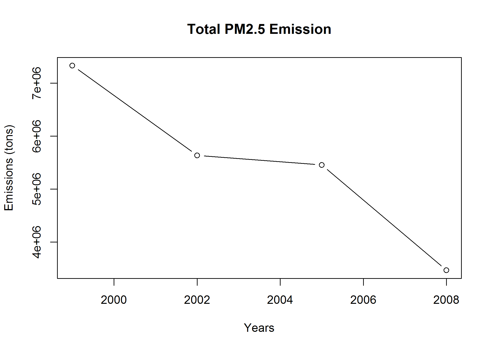
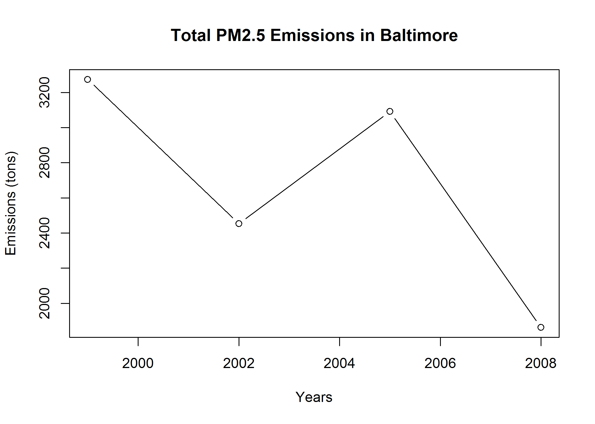
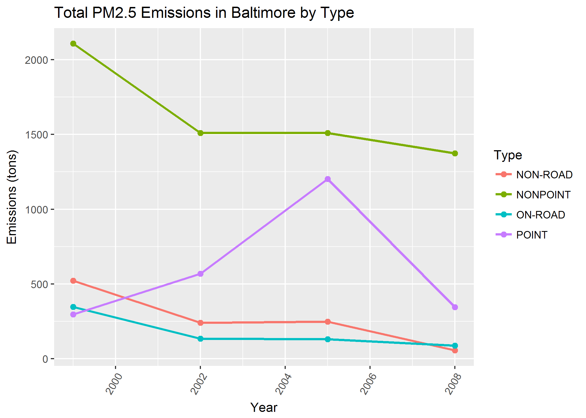
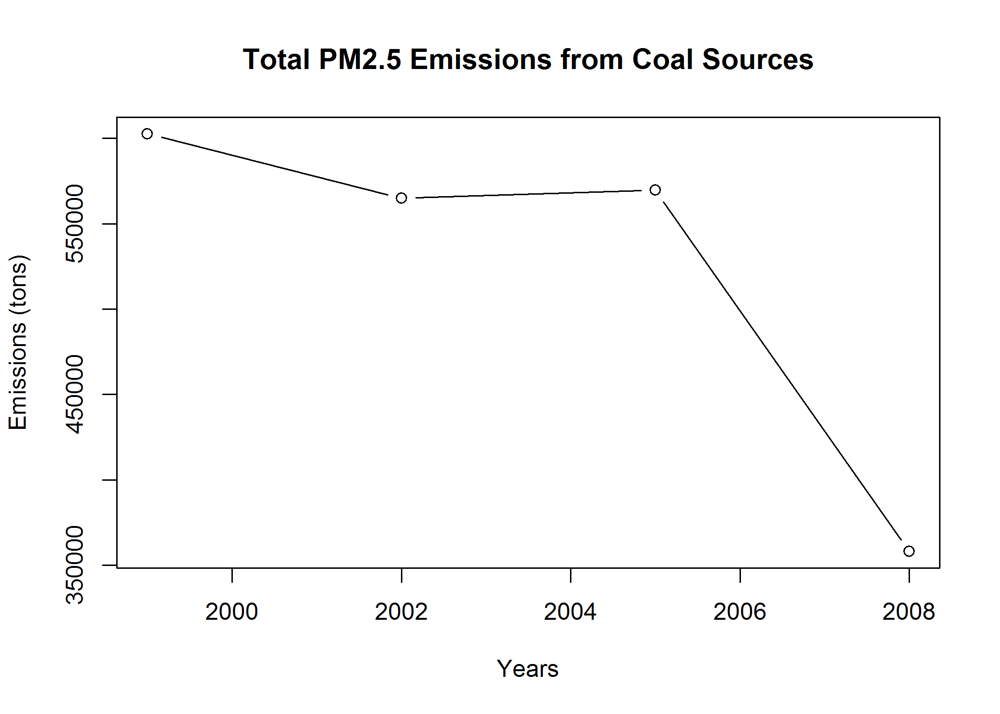
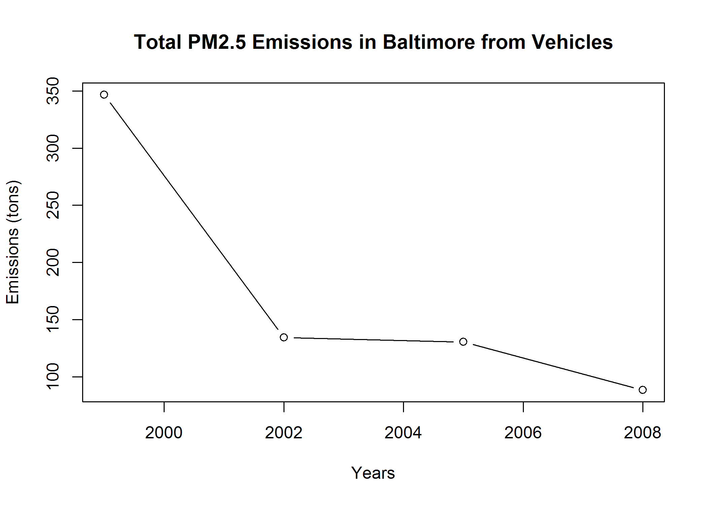
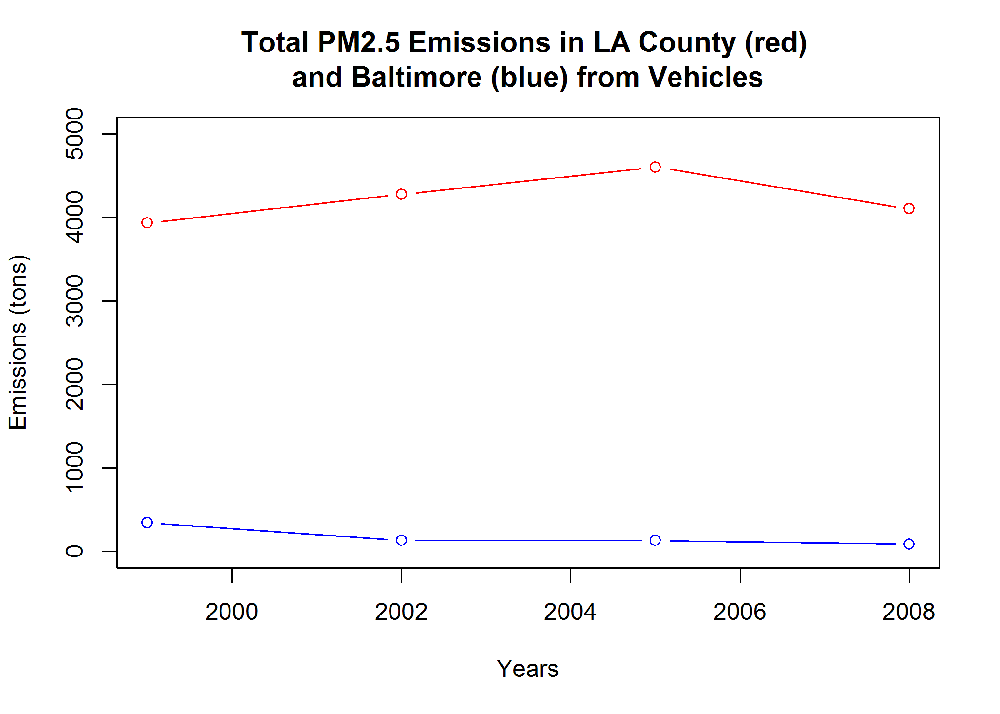

# Course Project 2: A look at the National Emissions Inventory
Damon Resnick  
January 24, 2017  


### Question 1: Have total emissions from PM2.5 decreased in the United States from 1999 to 2008? Using the base plotting system, make a plot showing the total PM2.5 emission from all sources for each of the years 1999, 2002, 2005, and 2008.  


```r
## This first line will likely take a few seconds. Be patient!
NEI <- readRDS("summarySCC_PM25.rds")
SCC <- readRDS("Source_Classification_Code.rds")
```

<br>  

#### Generate plot1

```r
p1 <- aggregate(Emissions ~ year, NEI, sum)
plot(p1, main = "Total PM2.5 Emission", xlab = "Years", ylab = "Emissions (tons)", 
    type = "b")
```



#### Save plot1 to file not evaluated

```r
png("plot1.png", width = 480, height = 480)
plot(p1, main = "Total PM2.5 Emission", xlab = "Years", ylab = "Emissions (tons)", 
    type = "b")
dev.off()
```

<br>  

### Question 2: Have total emissions from PM2.5 decreased in the Baltimore City, Maryland (fips == "24510") from 1999 to 2008? Use the base plotting system to make a plot answering this question.  

#### Generate plot2

```r
baltsubset <- subset(NEI, fips == "24510")
p2 <- aggregate(Emissions ~ year, baltsubset, sum)
plot(p2, main = "Total PM2.5 Emissions in Baltimore", xlab = "Years", ylab = "Emissions (tons)", 
    type = "b")
```



#### Save plot2 to file not evaluated

```r
png("plot2.png", width = 480, height = 480)
plot(p2, main = "Total PM2.5 Emissions in Baltimore", xlab = "Years", ylab = "Emissions (tons)", 
    type = "b")
dev.off()
```

<br>  

### Question 3: Of the four types of sources indicated by the type (point, nonpoint, onroad, nonroad) variable, which of these four sources have seen decreases in emissions from 1999-2008 for Baltimore City? Which have seen increases in emissions from 1999-2008? Use the ggplot2 plotting system to make a plot answer this question.  


#### Generate plot3

```r
library(ggplot2)
p3 <- aggregate(Emissions ~ year + type, baltsubset, sum)

plot3a <- ggplot(p3) + geom_point(aes(y = Emissions, x = year, color = type), size = 2) + 
    geom_line(aes(y = Emissions, x = year, color = type), size = 1)
plot3a + labs(title = "Total PM2.5 Emissions in Baltimore by Type", x = "Year", y = "Emissions (tons)", 
    color = "Type") + theme(axis.text.x = element_text(angle = 60, hjust = 1)) + 
    theme(legend.key = element_rect(fill = "NA"))
```



#### Save plot3 to file not evaluated

```r
png("plot3.png", width = 480, height = 480)
plot3a <- ggplot(p3) + geom_point(aes(y = Emissions, x = year, color = type), size = 2) + 
    geom_line(aes(y = Emissions, x = year, color = type), size = 1)
plot3a + labs(title = "Total PM2.5 Emissions in Baltimore by Type", x = "Year", y = "Emissions (tons)", 
    color = "Type") + theme(axis.text.x = element_text(angle = 60, hjust = 1)) + 
    theme(legend.key = element_rect(fill = "NA"))
dev.off()
```


<br>  

### Question 4: Across the United States, how have emissions from coal combustion-related sources changed from 1999-2008?  

#### Generate plot4

```r
mergedf <- merge(NEI, SCC, by = "SCC")
coal <- grepl("Coal", mergedf$Short.Name, ignore.case = TRUE)
mergedfsubset <- subset(mergedf, coal)
p4 <- aggregate(Emissions ~ year, mergedfsubset, sum)
plot(p4, main = "Total PM2.5 Emissions from Coal Sources", xlab = "Years", ylab = "Emissions (tons)", 
    type = "b")
```



#### Save plot4 to file not evaluated

```r
png("plot4.png", width = 480, height = 480)
plot(p4, main = "Total PM2.5 Emissions from Coal Sources", xlab = "Years", ylab = "Emissions (tons)", 
    type = "b")
dev.off()
```

<br>  

### Question 5: How have emissions from motor vehicle sources changed from 1999-2008 in Baltimore City?  

#### Generate plot5

```r
baltroadsubset <- subset(NEI, fips == "24510" & type == "ON-ROAD")
p5 <- aggregate(Emissions ~ year, baltroadsubset, sum)
plot(p5, main = "Total PM2.5 Emissions in Baltimore from Vehicles", xlab = "Years", 
    ylab = "Emissions (tons)", type = "b")
```



#### Save plot5 to file not evaluated

```r
png("plot5.png", width = 480, height = 480)
plot(p5, main = "Total PM2.5 Emissions in Baltimore from Vehicles", xlab = "Years", 
    ylab = "Emissions (tons)", type = "b")
dev.off()
```


<br>  

### Question 6: Compare emissions from motor vehicle sources in Baltimore City with emissions from motor vehicle sources in Los Angeles County, California (fips == "06037"). Which city has seen greater changes over time in motor vehicle emissions?   

#### Generate plot6

```r
baltroadsubset <- subset(NEI, fips == "24510" & type == "ON-ROAD")
laroadsubset <- subset(NEI, fips == "06037" & type == "ON-ROAD")

p5 <- aggregate(Emissions ~ year, baltroadsubset, sum)
p6 <- aggregate(Emissions ~ year, laroadsubset, sum)
plot(p6, ylim = range(0:5000), col = "red", main = "Total PM2.5 Emissions in LA County (red) \nand Baltimore (blue) from Vehicles", 
    xlab = "Years", ylab = "Emissions (tons)", type = "b")
lines(p5, ylim = range(0:5000), col = "blue", type = "b")
```



#### Save plot6 to file not evaluated

```r
png("plot6.png", width = 480, height = 480)
plot(p6, ylim = range(0:5000), col = "red", main = "Total PM2.5 Emissions in LA County (red) \nand Baltimore (blue) from Vehicles", 
    xlab = "Years", ylab = "Emissions (tons)", type = "b")
lines(p5, ylim = range(0:5000), col = "blue", type = "b")
dev.off()
```

